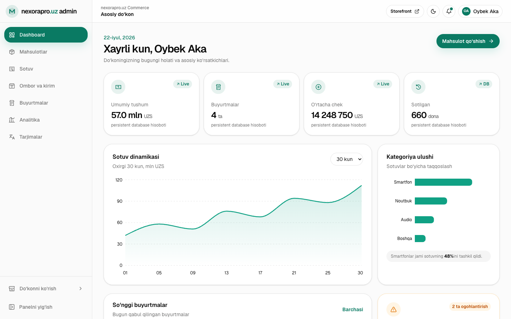

<div align="center">

# nexorapro.uz Commerce

**A full-stack electronics storefront and commerce operations platform.**

Storefront, inventory, orders, point of sale, analytics, localization, and
role-based administration — built as one production-minded Next.js application.

[](https://nexorapro.uz)
[](https://nextjs.org/)
[](https://www.typescriptlang.org/)
[](.github/workflows/deploy-production.yml)

[Live storefront](https://nexorapro.uz) · [API reference](docs/API.md) · [Architecture](docs/ARCHITECTURE.md) · [Deployment guide](docs/DEPLOYMENT.md) · [Roadmap](docs/ROADMAP.md)

</div>


## Overview

nexorapro.uz is a secured full-stack commerce MVP for electronics retailers.
It connects a premium customer experience with the operational tools needed to
publish products, receive inventory, process sales, manage orders, and review
business performance.

The storefront and admin workspace share one persistent source of truth. A
product published in the admin panel becomes available in the storefront; an
order updates stock and appears in operational reporting without duplicated
client-side state.

> **Portfolio project 01/10.** The current release targets a single Ubuntu VPS
> and uses SQLite intentionally. The architecture documents the migration path
> to PostgreSQL and object storage for multi-instance production workloads.

## Product highlights

| Customer experience | Commerce operations | Platform foundation |
| --- | --- | --- |
| Premium responsive storefront | Executive dashboard and analytics | Next.js App Router and Route Handlers |
| Searchable product catalog | Product publishing and archive lifecycle | Persistent SQLite in WAL mode |
| Product details and video showcase | Variant/media CRUD and bulk actions | Database-backed sessions and RBAC |
| Persistent cart and checkout | Inventory ledger and reservations | Structured errors, Zod and typed DAL |
| Map-based delivery location | Order status workflow and CSV export | Tagged cache invalidation |
| Account and private order history | Date-range sales/inventory reports | Atomic migrations, backup and audit log |

## Admin workspace



The admin experience includes dedicated workspaces for products, sales,
inventory, orders, analytics, and localization. Private actions are protected at
the server/API boundary; hiding a navigation item is never treated as
authorization.

## Architecture

```text
Customer storefront ─┐
                     ├─ Next.js 16 application ─ Route Handlers ─ repositories ─ SQLite
Admin workspace ─────┘           │                    │                 │
                                 │                    │                 ├─ users + sessions
                                 │                    │                 ├─ products + variants + media
                                 │                    │                 ├─ stock + reservations + ledger
                                 │                    │                 └─ orders + audit logs
                                 │                    └─ Zod + RBAC + cache invalidation
                                 └─ React 19 + Tailwind CSS + GSAP
```

Important implementation decisions:

- money and stock calculations are validated on the server;
- order creation and inventory deduction run in one transaction;
- cancelled orders restore product or variant stock in the same transaction;
- passwords are hashed with bcrypt and raw session tokens are never stored;
- customer and admin data are excluded from shared caches;
- public product and server-side report caches are invalidated after mutations;
- schema migrations are versioned and create a pre-migration SQLite snapshot;
- database and uploaded media live outside releases and survive rollouts.

See [docs/ARCHITECTURE.md](docs/ARCHITECTURE.md) for domain boundaries and the
long-term data model.

## Technology

| Layer | Technology |
| --- | --- |
| Application | Next.js 16 App Router, React 19, TypeScript 5 |
| UI | Tailwind CSS 4, shadcn/ui foundation, Base UI, Lucide |
| Forms and validation | React Hook Form, Zod |
| Data and authentication | better-sqlite3, bcrypt, opaque HttpOnly sessions |
| Tables and analytics | TanStack Table, Recharts |
| Motion and maps | GSAP, Yandex Maps, OpenStreetMap Nominatim geocoding |
| Production | GitHub Actions, Next.js standalone output, PM2, Nginx, Let's Encrypt |

## Working routes

| Route | Purpose |
| --- | --- |
| `/`, `/catalog`, `/product/[slug]` | Storefront discovery and product purchase flow |
| `/cart` | Cart and map-assisted checkout |
| `/login`, `/account` | Customer authentication and private order history |
| `/admin-login` | Separate administrator entry point |
| `/admin` | Business overview and live database totals |
| `/admin/products` | Product CRUD, variants, image upload, bulk lifecycle, CSV import/export |
| `/admin/sales` | Point of sale and stock-aware order creation |
| `/admin/inventory` | Variant stock, reservations, receipts, ledger, valuation and low-stock export |
| `/admin/orders` | Order search, details, and status transitions |
| `/admin/analytics` | Real date-range revenue, profit, AOV, daily, product and channel reports |
| `/admin/localization` | UZ/RU/EN completeness workflow |
| `/api/*` | Authenticated REST-style Route Handler API |

## Local development

Requirements: Node.js 24 and npm.

```bash
git clone https://github.com/OybekDeveloper/nexorapro-commerce-platform.git
cd nexorapro-commerce-platform
npm ci
cp .env.example .env.local
npm run dev
```

Open [http://localhost:3000](http://localhost:3000). The database is created
automatically at `data/nexora.db`.

`UPLOAD_DIR` must be an absolute writable path. In production it is
`/var/www/nexorapro/shared/uploads`; Nginx serves `/uploads/*` directly with an
immutable cache policy.

Production never uses the development admin fallback. Set a unique
`ADMIN_EMAIL` and `ADMIN_PASSWORD` before the first production start.

## Environment and secret safety

Only non-secret templates are committed:

- [`.env.example`](.env.example) — local development template;
- [`.github/production.env.example`](.github/production.env.example) — value
  template for the multiline `PRODUCTION_ENV_FILE` GitHub secret;
- [`.github/github-actions-secrets.example`](.github/github-actions-secrets.example)
  — names of all required deployment secrets.

Real `.env*` files, `.server-access`, SSH keys, and SQLite files are ignored.
The CI packaging step also fails if an environment or database file enters the
standalone release.

## Quality checks

```bash
npm run lint
npm run build
npm test
npm run benchmark:db
```

The integration suite starts the production server against a temporary SQLite
database and covers authentication, structured errors, product variants/media,
optimistic locking, inventory reservations, reports, import/export, bulk actions,
and soft deletion. The deterministic DB benchmark exercises 10,000 products,
5,000 orders, and 15,000 order lines.

The interface includes keyboard focus states, a skip link, semantic labels,
reduced-motion handling, responsive admin fallbacks, and layouts verified at
desktop and 375 px widths.

## Production deployment

Every push to `main` runs the production workflow:

1. install locked dependencies on a GitHub-hosted Ubuntu runner;
2. run ESLint, build the Next.js standalone server, and execute integration tests;
3. verify that no `.env` or SQLite files entered the release;
4. upload the compressed runtime to the VPS over pinned-key SSH;
5. atomically activate the release and reload one PM2 process;
6. call `/api/health` and automatically roll back on failure.

The VPS does **not** run `npm install` or `next build`, making the deployment
suitable for the initial 1 GB instance. Full setup instructions are in
[docs/DEPLOYMENT.md](docs/DEPLOYMENT.md).

## Current scope

This repository is a portfolio commerce platform, not a live payment processor.
Checkout creates transactional local orders; product media, variants, stock
reservations, imports, reports, audit logs and backups are implemented. Payment
capture, password recovery, email verification, refunds, supplier purchasing,
and external delivery integrations remain roadmap work. Multi-instance
deployment should move durable data to PostgreSQL/object storage and use a
distributed cache only after measurements justify it.

Product imagery and linked showcase media belong to their respective owners and
are used for portfolio demonstration. Prices and inventory are illustrative.

## Project links

- Website: [https://nexorapro.uz](https://nexorapro.uz)
- Source and author: [OybekDeveloper on GitHub](https://github.com/OybekDeveloper)
- LinkedIn build story: link will be added after the launch post is published

<!-- LINKEDIN_POST_URL: Replace the line above with the final LinkedIn post URL. -->

## License

Released under the [MIT License](LICENSE).
